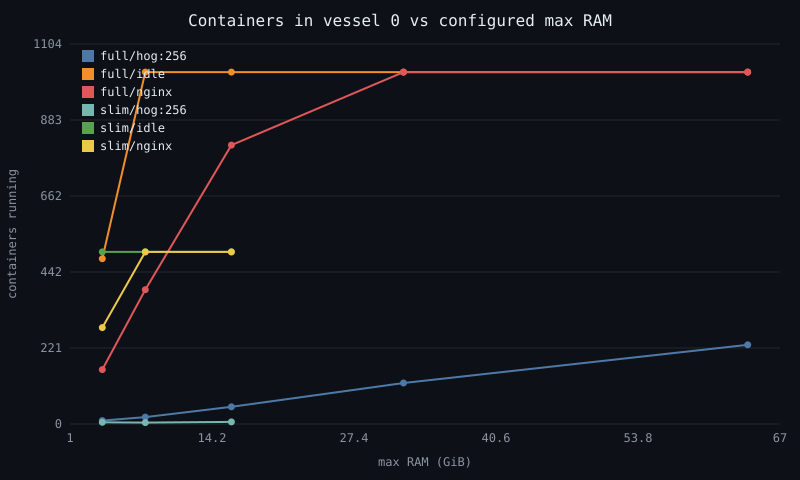
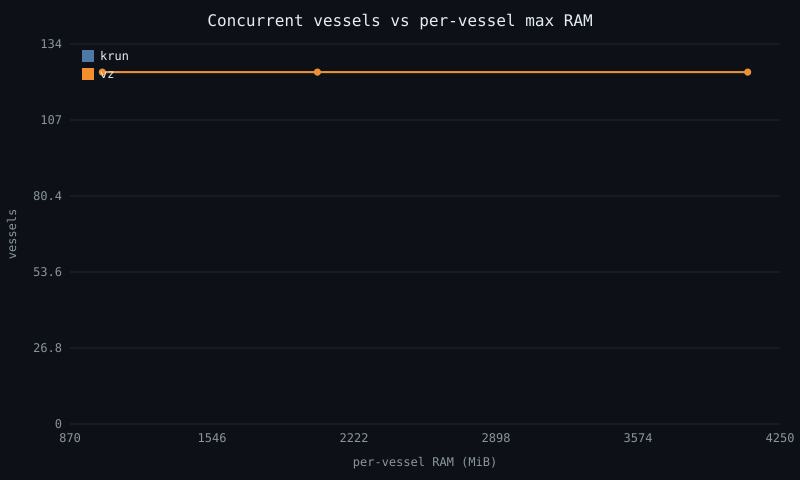

# Nebula battle-test report

Generated from `bench/results`. Newest run of each scenario wins.

## Containers in vessel 0 vs max RAM

| flavor | workload | max RAM (MiB) | containers | stop reason | errors |
|---|---|---|---|---|---|
| full | hog:256 | 4096 | 10 | cmd_error: 5/10 of a batch failed; last: exit Some(125): docker: error during connect: Hea… | 5 |
| full | hog:256 | 8192 | 20 | guest_oom: 16 new kills | 2 |
| full | hog:256 | 16384 | 50 | guest_oom: 10 new kills | 3 |
| full | hog:256 | 32768 | 119 | guest_oom: 9 new kills | 1 |
| full | hog:256 | 65536 | 230 | guest_oom: 5 new kills | 0 |
| full | idle | 4096 | 480 | timeout: docker run #482 | 1 |
| full | idle | 8192 | 1022 | cmd_error: 5/10 of a batch failed; last: exit Some(125): docker: Error response from daemo… | 5 |
| full | idle | 16384 | 1022 | cmd_error: 5/10 of a batch failed; last: exit Some(125): docker: Error response from daemo… | 5 |
| full | idle | 32768 | 1022 | cmd_error: 5/10 of a batch failed; last: exit Some(125): docker: Error response from daemo… | 5 |
| full | idle | 65536 | 1022 | cmd_error: 5/10 of a batch failed; last: exit Some(125): docker: Error response from daemo… | 5 |
| full | nginx | 4096 | 158 | timeout: docker run #159 | 1 |
| full | nginx | 8192 | 390 | timeout: docker run #397 | 1 |
| full | nginx | 16384 | 810 | timeout: docker run #820 | 1 |
| full | nginx | 32768 | 1022 | cmd_error: 5/10 of a batch failed; last: exit Some(125): docker: Error response from daemo… | 5 |
| full | nginx | 65536 | 1022 | cmd_error: 5/10 of a batch failed; last: exit Some(125): docker: Error response from daemo… | 5 |
| slim | hog:256 | 4096 | 5 | max_n: reached configured cap 1500 | 0 |
| slim | hog:256 | 8192 | 4 | max_n: reached configured cap 1500 | 0 |
| slim | hog:256 | 16384 | 6 | max_n: reached configured cap 1500 | 0 |
| slim | idle | 4096 | 500 | cmd_error: 5/10 of a batch failed; last: exit Some(125): docker: error during connect: Hea… | 5 |
| slim | idle | 8192 | 500 | cmd_error: 5/10 of a batch failed; last: exit Some(125): docker: error during connect: Hea… | 5 |
| slim | idle | 16384 | 500 | cmd_error: 5/10 of a batch failed; last: exit Some(125): docker: error during connect: Hea… | 5 |
| slim | nginx | 4096 | 280 | cmd_error: 5/10 of a batch failed; last: exit Some(125): docker: error during connect: Hea… | 5 |
| slim | nginx | 8192 | 500 | cmd_error: 5/10 of a batch failed; last: exit Some(125): docker: error during connect: Hea… | 5 |
| slim | nginx | 16384 | 500 | cmd_error: 5/10 of a batch failed; last: exit Some(125): docker: error during connect: Hea… | 5 |

## Concurrent vessels vs per-vessel RAM

| backend | mem (MiB) | vessels | stop reason | boot first→last (ms) | host cost/vessel (MiB) |
|---|---|---|---|---|---|
| krun | 1024 | 124 | cmd_error: vessels new bt-v124: exit Some(1): Error: vessel `bt-v124` did not become healt… | 141→119 | 59 |
| krun | 2048 | 124 | cmd_error: vessels new bt-v124: exit Some(1): Error: vessel `bt-v124` did not become healt… | 5268→5251 | 49 |
| krun | 4096 | 124 | cmd_error: vessels new bt-v124: exit Some(1): Error: vessel `bt-v124` did not become healt… | 114→241 | 108 |
| vz | 1024 | 124 | cmd_error: vessels new bt-v124: exit Some(1): Error: vessel `bt-v124` did not become healt… | 355→410 | 54 |
| vz | 2048 | 124 | cmd_error: vessels new bt-v124: exit Some(1): Error: vessel `bt-v124` did not become healt… | 340→371 | 59 |
| vz | 4096 | 124 | cmd_error: vessels new bt-v124: exit Some(1): Error: vessel `bt-v124` did not become healt… | 345→357 | 88 |

## Balloon contract

Latest run `20260612-175226-Suyogs-MacBook-Pro-balloon`: **PASS**

| metric | value |
|---|---|
| ceiling.hog_mib | 8865.0 |
| ceiling.hog_survived | 1.0 |
| ceiling.oom_kills | 0.0 |
| concurrent.min_held_mib | 5619.0 |
| drift.held_degrade_pct | 0.1 |
| drift.reinflate_median_s | 56.4 |
| hog.min_held_mib | 20408.0 |
| hog.peak_fp_mib | 7998.0 |
| hog.reinflate_s | 36.2 |
| hog.settled_fp_mib | 8006.0 |
| idle.fp_mib | 2198.0 |
| idle.held_mib | 29678.0 |
| idle.settle_s | 64.4 |
| sawtooth.cycles | 10.0 |
| sawtooth.resizes | 7.0 |
| sawtooth.resizes_per_cycle | 0.7 |

